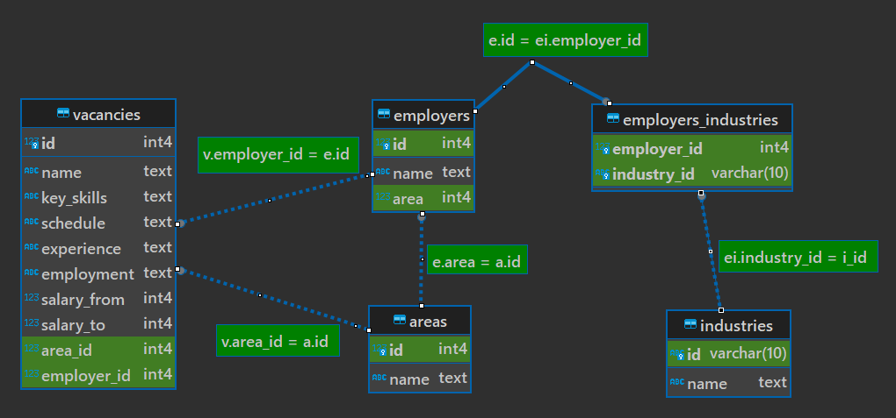

# Проект 2. Анализ вакансий базы данных HeadHunter.

## Оглавление  
[1. Описание проекта](#Описание-проекта)  
[2. Краткая информация о данных](#Краткая-информация-о-данных)  
[3. Этапы работы над проектом](#Этапы-работы-над-проектом)  
[4. Результат](#Результат)    
[5. Collab link](#P.S.) 

### Описание проекта    
Проект представляет собой тренировку по написанию sql запросов, анализируя при этом базу данных вакансий компании HeadHunter.

:arrow_up:[к оглавлению](#Оглавление)

### Краткая информация о данных
База содержит 5 таблиц:
1. **VACANCIES**  
Таблица хранит в себе данные по вакансиям:  
  
Зарплатная вилка — это верхняя и нижняя граница оплаты труда в рублях (зарплаты в других валютах уже переведены в рубли). Соискателям она показывает, в каком диапазоне компания готова платить сотруднику на этой должности.  

2. **AREAS**  
Таблица-справочник, которая хранит код региона и его название.  
  

3. **EMPLOYERS**  
Таблица-справочник со списком работодателей.  
  

4. **INDUSTRIES**  
Таблица-справочник вариантов сфер деятельности работодателей.  
  

5. **EMPLOYERS_INDUSTRIES**  
Дополнительная таблица, которая существует для организации связи между работодателями и сферами их деятельности.   
Эта таблица нужна нам, поскольку у одного работодателя может быть несколько сфер деятельности (или работодатели могут вовсе не указать их). Для удобства анализа необходимо хранить запись по каждой сфере каждого работодателя в отдельной строке таблицы.  
  

Карта взаимосвязей:  

  
  
:arrow_up:[к оглавлению](#Оглавление)

### Этапы работы над проектом  
Анализ разбит на 4 этапа: 
- предварительный анализ, в котором мы знакомимся с общим количеством различных показателей таблиц;
- детальный анализ, в котором мы наблюдаем взаимосвязь таблицы вакансий с остальными таблицами, а так же взаимосвязь признаков таблицы вакансий;
- анализ работодателей, в котором мы делаем упор на таблицу работодателей; 
- предметный анализ, в котором мы исследуем вакансии Data Science сферы.

:arrow_up:[к оглавлению](#Оглавление)

### Результаты 
В результате мы тренируемся в написании sql запросов.

:arrow_up:[к оглавлению](#Оглавление)

### P.S.
Если вам лениво читать мои ваяния тут, клонировать.. скачивать.. вот [ссылка на колаб](https://colab.research.google.com/drive/1fGwSvUwtdi6kUOxINlZyvWcQStoNEIuB?usp=sharing).

---

⬅️ [BACK TO REPO](https://github.com/Akialema/PROJECTS.EDU/tree/main) ⬅️